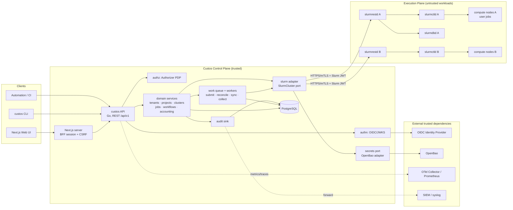
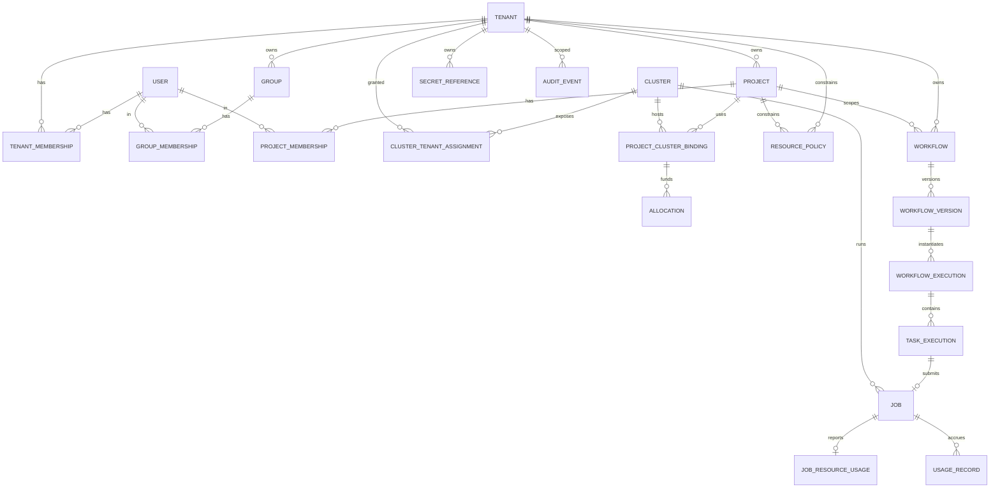

# Custos Architecture

Status: Milestone 0 (design). No application code exists yet; this document is
the contract the first milestones are built against. Sections that describe
future behavior are marked as such.

## 1. System overview

Custos is a multi-tenant control plane that sits between people/automation and
one or more Slurm clusters. It owns identity mapping, tenancy, authorization,
policy, workflow orchestration, job bookkeeping, accounting visibility, and
audit. It does **not** schedule work itself; Slurm remains the scheduler and
the execution authority.

```text
users / CLI / automation ──► Custos API ──► slurmrestd (cluster A)
                                   │     ──► slurmrestd (cluster B)
                                   ├──► PostgreSQL (state, metadata, accounting)
                                   ├──► OpenBao   (secrets, by reference only)
                                   └──► OIDC IdP  (token validation only)
```

Non-goals (explicit):

- Replacing or wrapping every slurmrestd endpoint.
- Acting as an identity provider.
- Acting as a general secrets store.
- Being a meta-scheduler in the first milestones (interfaces only).

## 2. Architecture diagram



## 3. Trust boundaries

| Boundary | Inside | Outside | Crossing rules |
| --- | --- | --- | --- |
| B1: Internet / clients → Custos | API, BFF | browsers, CLI, automation | TLS; OIDC bearer (CLI/automation) or BFF session cookie (browser); request size limits; rate limiting; request IDs |
| B2: Custos → PostgreSQL | DB | app | TLS; app role with least privilege; every query tenant-scoped; RLS as defense-in-depth |
| B3: Custos → OpenBao | OpenBao | app | Workload identity (Kubernetes/JWT auth) → short-lived token; per-tenant namespaces; references stored, values never |
| B4: Custos → slurmrestd | control plane | execution plane | HTTPS/mTLS; per-cluster Slurm JWT fetched from OpenBao at use time; Custos only ever sends *validated, allow-listed* job descriptions |
| B5: Slurm → compute nodes / jobs | execution plane | untrusted user code | Jobs receive only job-scoped material (never Custos DB creds, never OpenBao platform tokens); any secret handed to a job is scoped, short-lived and audited |
| B6: Custos → IdP | IdP | app | Discovery + JWKS over TLS; keys cached; Custos never receives user passwords |

Principle: **the control plane is the only holder of platform credentials; the
execution plane is hostile.** Anything that runs inside a Slurm job could be
attacker-controlled; nothing the job says is trusted back into Custos without
going through the same authenticated, authorized API as any other client.

## 4. Style: modular monolith

One deployable Go binary (`custos`) with multiple run modes (`serve`, `worker`,
`migrate`) selected by flags. API and workers can be scaled independently as
separate Deployments of the same image. See ADR-001.

Rules inside the monolith:

- `internal/<domain>` packages contain domain types, service logic, and the
  *ports* (interfaces) they consume. They import nothing from `http`, `pgx`,
  OpenBao, or Slinky.
- Adapters live in `internal/<domain>/postgres`, `internal/slurm/slinky`,
  `internal/secrets/openbao`, `internal/api/...` and depend inward only.
- Wiring happens in `cmd/custos` (plain constructors; no DI framework).
- Interfaces are declared by the consumer and kept small.

## 5. Repository layout

The prompt's proposed layout is retained with a few deliberate changes,
explained below.

```text
cmd/
  custos/                 main; subcommands: serve, worker, migrate, version
internal/
  platform/               cross-cutting infra, no domain logic
    config/               load + validate config (fail closed)
    log/                  slog setup, redaction helpers
    otel/                 tracer/meter providers, prometheus exporter
    db/                   pgx pool, tx helper, migrate runner
    httpx/                middleware: request id, recover, limits, headers, CORS
    clock/, ids/          time & ULID/UUIDv7 helpers (testability)
  authn/                  Principal, OIDC verifier, JWKS cache (port + impl)
  authz/                  Authorizer port, RBAC implementation, permission catalog
  tenants/                Tenant, TenantMembership, Group, tenant-scope resolution
  users/                  User provisioning from OIDC claims
  projects/               Project, ProjectMembership, cluster access, Slurm account mapping
  clusters/               Cluster registry, capabilities, tenant assignments, sync
  slurm/                  SlurmCluster port, neutral types, fake; slinky/ adapter
  jobs/                   Job aggregate, submission, cancellation, reconciliation
  scripts/                content-addressed payload storage, digests, size limits
  validation/             ScriptValidator port, pipeline, severity policy; shsyntax/ sbatchscan/ shellcheck/ envcheck/ softwareenv/
  admission/              ExecutionSpec builder (policy → entitlement → allocation → admission → placement)
  submission/             wrapper generation + ExecutionSpec → slurm.JobSubmission mapping
  workflows/              Definition/Version, spec parsing, schema, DAG validation
  executions/             WorkflowExecution/TaskExecution state machine + engine
  placement/              PlacementEngine port + explicit/static implementation
  policies/               tenant/project resource policy evaluation
  allocations/            Allocation, budget checks
  accounting/             UsageRecord collection + aggregation queries
  secrets/                SecretReference, Secrets port; openbao/ adapter; fake
  artifacts/              Artifact + Storage port (interfaces only early)
  audit/                  AuditEvent, Recorder port, postgres sink, forwarders
  workqueue/              durable PG-backed queue: WorkItem, lease, retry, DLQ
  api/                    HTTP layer only
    v1/                   handlers, DTO mapping, error envelope
    openapi/              embedded openapi.yaml + served /api/v1/openapi.json
pkg/
  api/v1/                 public request/response types (CLI + UI codegen source)
  workflowspec/           public workflow YAML/JSON schema types + validator
migrations/               numbered SQL migrations (goose-style up/down)
web/                      Next.js app
deploy/
  container/              Containerfiles
  helm/custos/            chart
docs/                     this directory; docs/adr/
```

Changes from the prompt's suggestion and why:

- `auth/` split into `authn/` and `authz/`. The prompt requires these to be
  separate concerns; separate packages enforce it at compile time.
- `scheduler/` renamed to `placement/`. "Scheduler" invites confusion with
  Slurm; Custos only chooses *where*, Slurm decides *when*.
- `metrics/` dropped as a domain package. Operational metrics are a
  cross-cutting concern (`platform/otel`); persisted analytics are
  `accounting/`. Having a `metrics` domain package invites high-cardinality
  Prometheus misuse.
- `notifications/` deferred; not needed before Milestone 8.
- `platform/` added to hold infra glue so domain packages stay import-clean.
- `scripts/`, `validation/`, `admission/`, `submission/` added: the
  untrusted-payload → validated `ExecutionSpec` → Slurm envelope chain is
  security-critical and gets its own packages with a compile-time rule
  (`depguard`) that `admission` and `submission` cannot import `scripts`
  bodies — only digests. See `docs/script-validation.md`.
- `pkg/workflowspec` is public because the CLI (`custos workflow validate`)
  and the UI need the same schema and validator.

## 6. Core domain model



Entities and the relationships that matter:

| Entity | Notes |
| --- | --- |
| `User` | Platform-global identity, keyed by (`issuer`, `subject`). Not tenant-owned; a user may belong to many tenants. Email/display name are cached claims, not authoritative. |
| `Tenant` | Isolation unit. Has `slug`, state, OpenBao namespace name, settings. |
| `TenantMembership` | (`tenant_id`, `user_id`) → tenant roles. Membership is the *only* way a user gains any tenant-scoped permission. |
| `Group` | Tenant-owned; used to grant project membership/roles in bulk. Optionally sourced from IdP group claims (mapping rules stored per tenant). |
| `Project` | Tenant-owned unit of work and accounting. Has members, cluster bindings, policies, workflows. |
| `ProjectMembership` | (`project_id`, `user_id`) → project roles. Project members must already be tenant members (enforced in service + DB trigger). |
| `Cluster` | Platform-owned registry entry: endpoint, API version, TLS config, credential `SecretReference`, capabilities snapshot, sync status. Clusters are never tenant-owned. |
| `ClusterTenantAssignment` | Grants a tenant visibility of a cluster plus optional tenant-level defaults (default account prefix, allowed partitions). A "global" cluster is modeled as an assignment row per tenant created by policy, not as a NULL tenant — keeps every access query a simple join. |
| `ProjectClusterBinding` | The explicit mapping Project → Cluster → Slurm account (+ allowed QoS/partitions, default partition). This is where "which Slurm account do I use" is answered. Many-to-many; not 1:1. |
| `Allocation` | Budget attached to a `ProjectClusterBinding` (unit: cpu-hours, gpu-hours, node-hours, or Slurm TRES-minutes), with period and limits. Consumption is derived from `UsageRecord`s. |
| `ResourcePolicy` | Declarative limits (max walltime, max nodes, allowed partitions/QoS, allowed task types, shell allowed?) attached to tenant or project. Effective policy = intersection. |
| `Workflow` | Tenant-owned (optionally project-scoped) mutable header: name, description, current published version pointer. |
| `WorkflowVersion` | Immutable. Stores canonical spec JSON, spec hash, schema version, UI layout JSON (separately), state (draft/published/deprecated). |
| `WorkflowExecution` | One run of one exact `WorkflowVersion`, with resolved parameters, placement, requested-by, idempotency key, state. |
| `TaskExecution` | One task node of an execution; state, attempt, resolved resource request, and pointer to `Job` when submitted. Fan-out creates N `TaskExecution`s from one task definition (`task_name`, `index`). |
| `Job` | Custos job (globally unique ID). References `cluster_id` and `slurm_job_id` (+ array task id), state, exit code, timestamps, `resource_request` and `resource_usage` JSON. Can exist without a workflow (ad-hoc batch job, Milestone 4). |
| `SecretReference` | Tenant-owned metadata pointing to OpenBao (`provider`, `namespace`, `mount`, `path`, `key`, `version`), with intended use and ACL. Never a value. |
| `UsageRecord` | Collected from slurmdbd per job (or per accounting window), keyed by (`cluster_id`, `slurm_job_id`, `step`), joined to `Job`/`Project`/`User` when resolvable. Append-only. |
| `AuditEvent` | Append-only, tenant-scoped or platform-scoped. |
| `WorkItem` | Durable queue row (see `docs/workers.md`). |

Refinements versus the prompt's list:

- `WorkflowTask` is not a table. Tasks live inside the immutable
  `WorkflowVersion.spec` document; materializing them as rows only adds joins
  and a second source of truth. `TaskExecution` is the per-run row.
- `JobResourceRequest` / `JobResourceUsage` are JSONB columns on `Job` with a
  typed Go struct and a versioned shape, not separate tables. They are read
  together with the job in >95% of cases; analytics over them go through
  `UsageRecord`, which is columnar.
- `ClusterCapability` is a JSONB snapshot on `Cluster` (partitions, GRES
  types, features, QoS list, max limits) refreshed by the cluster-sync worker,
  plus a small `cluster_partitions` table because partition names are used in
  policy joins.
- `ProjectClusterBinding` is added; it did not exist in the prompt but is the
  natural home for account/QoS/allocation mappings.

## 7. PostgreSQL schema strategy

- **Primary keys**: UUIDv7 (time-ordered, generated in Go via
  `crypto/rand`-backed generator; no sequences). Time ordering keeps B-tree
  inserts local; avoiding sequences keeps CockroachDB an option.
- **Tenant scoping**: every tenant-owned table has `tenant_id UUID NOT NULL`
  and every unique constraint on tenant-owned data includes `tenant_id`.
  Repository methods take a `tenants.Scope` value type, never a raw UUID from
  the request. Cross-tenant tables (`users`, `clusters`, `work_items`) are
  platform-scoped and only touched by platform services.
- **Row Level Security**: enabled on tenant-owned tables as defense-in-depth.
  The app sets `SET LOCAL app.tenant_id = ...` per transaction; platform
  operations use a separate role with `BYPASSRLS`. RLS is *not* the
  authorization system; it catches a forgotten `WHERE tenant_id = $1`.
- **Migrations**: plain SQL files, forward and backward, run by
  `custos migrate` (library: `pressly/goose` embedded via `embed.FS`; see
  ADR-002). Migrations run as a separate step, never on API startup.
- **Concurrency**: optimistic concurrency with an integer `version` column on
  aggregates that have state machines (`jobs`, `workflow_executions`,
  `task_executions`, `clusters`). `UPDATE ... WHERE id=$1 AND version=$2`.
  Work-queue leasing uses `SELECT ... FOR UPDATE SKIP LOCKED`. No advisory
  locks.
- **Append-only tables**: `audit_events`, `usage_records`. No UPDATE/DELETE
  grants for the app role; partitioned by month (`PARTITION BY RANGE
  (occurred_at)`) with pre-created partitions maintained by a worker.
  Partitioning is the main scaling lever for "millions of jobs".
- **Large tables** (`jobs`, `task_executions`, `usage_records`): indexed by
  (`tenant_id`, `created_at DESC`), (`tenant_id`, `project_id`,
  `created_at DESC`), (`cluster_id`, `slurm_job_id`) unique-where-not-null.
  Keyset pagination everywhere; never `OFFSET`.
- **JSONB** used only for genuinely document-shaped data (workflow spec,
  layout, resource request/usage, capability snapshots). Everything queried
  by is a real column.
- **Hardening baseline** (ADR-013): SCRAM-only auth, TLS `verify-full`
  outside dev, `pgcrypto`, `audit_events` append-only enforced by triggers
  (UPDATE/DELETE/TRUNCATE), split migrate vs. least-privilege app roles,
  and a fail-closed startup preflight — test stacks held to the same
  standard.
- **CockroachDB compatibility**: avoid `SERIAL`, advisory locks, `LISTEN/NOTIFY`,
  and DDL inside transactions with DML. `SKIP LOCKED` is supported in CRDB
  23.2+. Partitioning syntax differs; partitioning is isolated in
  migrations marked as PG-specific.
- **Driver**: `pgx/v5` directly with hand-written SQL plus `sqlc`-free typed
  scanning helpers. No ORM. (ADR-002 covers the alternatives.)

## 8. Request lifecycle and context

Every request establishes, in order:

1. `RequestID` (from `X-Request-ID` if well-formed, else generated) — attached
   to logs, traces, errors, audit.
2. `Principal` — from bearer JWT (OIDC) or BFF session. Contains
   `UserID`, `Issuer`, `Subject`, token scopes, and the *platform* roles.
3. `TenantContext` — from the URL (`/api/v1/tenants/{tenantSlug}/...`) for
   tenant-scoped routes, **validated by loading the caller's membership**.
   No membership → 404 (not 403, to avoid tenant enumeration) unless the
   principal is a platform admin/auditor.
4. Authorization — `Authorizer.Check(ctx, principal, action, resource)` in
   the service layer, not the handler, so CLI/UI/workers all go through it.

All three are carried in `context.Context` as typed keys owned by
`internal/authn` and `internal/tenants`, with accessor functions that fail
loudly when missing.

## 9. REST API layout (summary)

Tenant-scoped resources are nested under the tenant so scope is structural,
not a query parameter. Full conventions are in `docs/api.md`.

```text
/api/v1/me
/api/v1/tenants                                       (platform admin)
/api/v1/tenants/{tenant}
/api/v1/tenants/{tenant}/members
/api/v1/tenants/{tenant}/groups
/api/v1/tenants/{tenant}/projects
/api/v1/tenants/{tenant}/projects/{project}/members
/api/v1/tenants/{tenant}/projects/{project}/cluster-bindings
/api/v1/tenants/{tenant}/clusters                     (clusters visible to tenant)
/api/v1/tenants/{tenant}/workflows
/api/v1/tenants/{tenant}/workflows/{workflow}/versions
/api/v1/tenants/{tenant}/workflow-executions
/api/v1/tenants/{tenant}/jobs
/api/v1/tenants/{tenant}/secret-references
/api/v1/tenants/{tenant}/policies
/api/v1/tenants/{tenant}/accounting/usage
/api/v1/tenants/{tenant}/audit-events
/api/v1/clusters                                      (platform admin registry)
/api/v1/clusters/{cluster}/nodes | partitions | health
/api/v1/audit-events                                  (platform auditor)
/health/live  /health/ready  /metrics
```

## 10. Major risks

| Risk | Mitigation |
| --- | --- |
| Slinky wrapper covers only Node/Job objects; accounting must use generated clients whose types churn per Slurm version | Own neutral types in `internal/slurm`; one adapter file per API version; contract tests against a recorded slurmrestd fixture set |
| slurmrestd JWT semantics (`X-SLURM-USER-NAME` / `X-SLURM-USER-TOKEN`) mean Custos acts as a proxy identity | Per-cluster service identity with `auth/jwt` and mapping Custos users → Slurm users via `ProjectClusterBinding`; document that slurmrestd must run with `--` restricted `auth/jwt` and Custos-only network access |
| Duplicate job submission on retry/network failure | Idempotency keys + client-supplied `job_name` embedding Custos job ID + reconcile-by-name before resubmit (see `docs/workers.md`) |
| Prometheus cardinality explosion | Label allow-list enforced in `platform/otel`; per-user/job data only in PostgreSQL |
| Workflow spec drift between UI, CLI and backend | Single Go validator in `pkg/workflowspec`; JSON Schema generated from it and consumed by the UI |
| OpenBao outage | Fail closed for new submissions, keep running executions observable; cached short-lived tokens with bounded TTL; readiness reports degraded, not down |
| Small team operating many components | One binary, one database, no brokers; Kubernetes manifests with sane defaults |
| Payload-driven policy bypass (#SBATCH, env, nested srun) | ExecutionSpec invariant + sbatchscan + envcheck; native Slurm limits required for hostile workloads (docs/script-validation.md) |
| GPLv3 ShellCheck in an Apache-2.0 project | process boundary only (sidecar), never linked |
