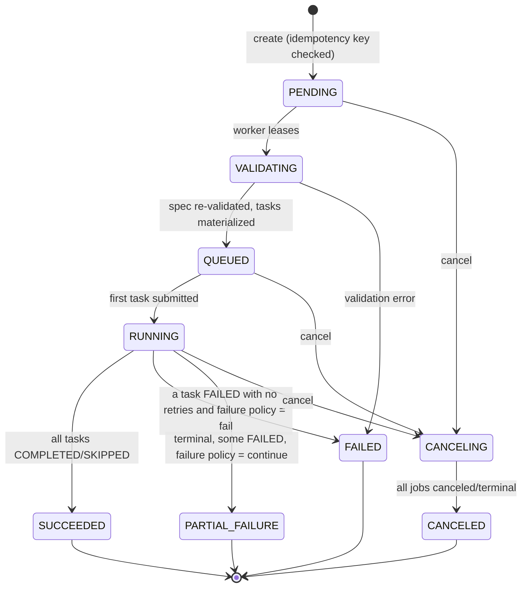
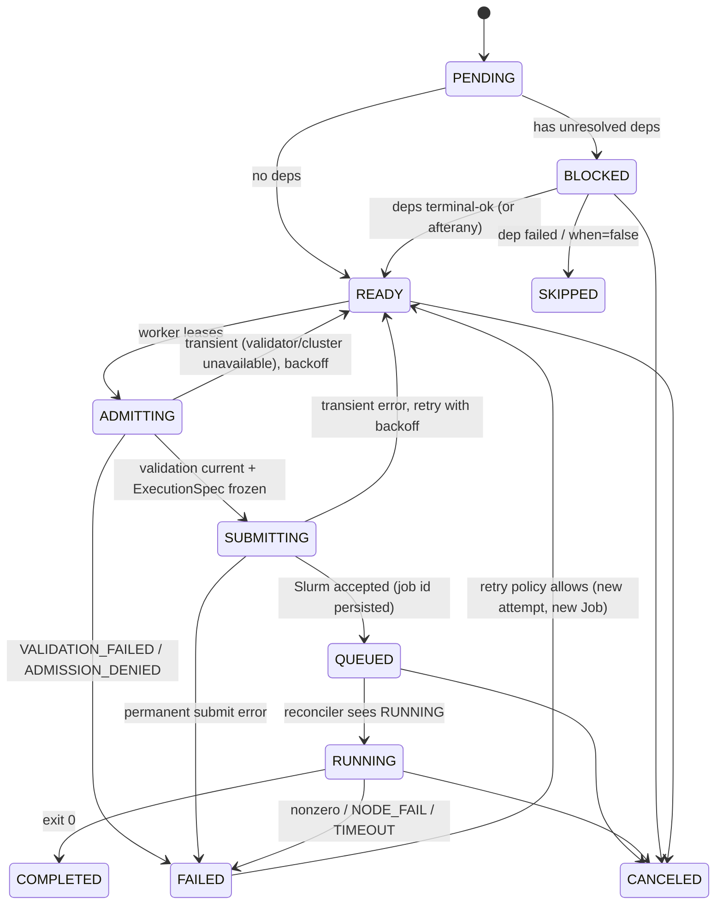

# Workflows

## Objects

| Object | Mutability | Purpose |
| --- | --- | --- |
| `Workflow` | mutable header | name, description, project scope, pointer to latest published version |
| `WorkflowVersion` | immutable once `published` | canonical spec (JSON), `spec_hash`, `schema_version`, `layout` (UI-only JSON), author, state `draft → published → deprecated` |
| `WorkflowExecution` | state machine | one run of exactly one version with resolved parameters |
| `TaskExecution` | state machine | one node instance (fan-out yields many per task) |
| `Job` | state machine | the Slurm-facing record for a task execution attempt |

Drafts are editable in place; publishing freezes them. Editing a published
version creates a new draft. Executions reference `workflow_version_id` and
also store a copy of `spec_hash` so tampering is detectable.

The UI layout (node positions, collapsed groups, colors) is stored in
`layout` and is **never** read by the engine.

## Specification (`custos.io/v1alpha1`)

Authoritative definition: Go types in `pkg/workflowspec` with a generated
JSON Schema (`pkg/workflowspec/schema/v1alpha1.json`) consumed by the UI and
CLI. YAML is accepted at the API and converted to canonical JSON
(sorted keys) before hashing and storage.

```yaml
apiVersion: custos.io/v1alpha1
kind: Workflow
metadata:
  name: gaussian-simulation
  labels: { domain: chemistry }
spec:
  parameters:
    molecule:   { type: string, required: true, pattern: "^[a-zA-Z0-9_-]{1,64}$" }
    iterations: { type: integer, default: 100, minimum: 1, maximum: 100000 }
    shards:     { type: integer, default: 4, minimum: 1, maximum: 256 }

  placement:                       # workflow default; tasks may override
    cluster: summit                # OR requirements: {...}
    # requirements:
    #   gpu: { type: H100, count: 8 }
    #   memoryPerNode: 512Gi

  defaults:
    account: null                  # resolved from project binding unless overridden
    partition: compute
    qos: normal
    workingDirectory: "{{ run.scratch }}"
    env:
      OMP_NUM_THREADS: "{{ task.resources.cpu }}"

  secrets:                         # references by handle; resolved by tenant SecretReference name
    hfToken: { ref: hf-token, use: env, envName: HF_TOKEN }

  tasks:
    - name: prepare
      type: batch
      resources: { cpu: 4, memory: 8Gi, walltime: 30m }
      command: ["./prepare", "{{ parameters.molecule }}"]
      outputs:
        shardList: { type: file, path: "shards.json" }

    - name: simulate
      type: mpi
      dependsOn: [prepare]
      fanOut:
        count: "{{ parameters.shards }}"      # static fan-out from a parameter
        # OR from: prepare.outputs.shardList  # dynamic fan-out (Milestone 5b)
      resources: { nodes: 8, tasksPerNode: 64, memoryPerNode: 128Gi, walltime: 4h }
      command: ["./simulate", "--shard", "{{ item.index }}"]
      retry: { attempts: 2, on: [FAILED, NODE_FAIL] }

    - name: merge
      type: batch
      dependsOn: [simulate]        # fan-in: waits for all simulate instances
      when: "{{ tasks.simulate.succeededCount }} > 0"
      resources: { cpu: 16, memory: 64Gi, walltime: 1h }
      command: ["./merge"]

    - name: train
      type: gpu
      dependsOn: [merge]
      resources: { gpu: { count: 4, type: a100 }, cpu: 32, memory: 256Gi, walltime: 12h }
      software:                    # structured; resolved against the cluster software catalog
        - { name: python, version: "3.13" }
        - { name: cuda, version: "12.8" }
      script: { ref: "sha256:9f2c…", language: python }   # payload stored content-addressed
      args: ["--epochs", "{{ parameters.iterations }}"]
      env: { WANDB_MODE: offline }

    - name: sweep
      type: array
      dependsOn: [merge]
      array: { start: 0, end: 99, maxConcurrent: 20 }
      command: ["./sweep", "{{ array.taskId }}"]
```

### Task types (v1alpha1)

| type | Slurm mapping | Notes |
| --- | --- | --- |
| `batch` | one sbatch | default |
| `mpi` | sbatch with `nodes/ntasks-per-node`; command executed via `srun` | Custos emits `srun --ntasks=... <argv>` |
| `gpu` | sbatch with `--gres=gpu[:type]:N` | requires cluster GRES capability |
| `array` | sbatch `--array` | one `TaskExecution`, one `Job`; array task states aggregated |
| `shell` | Custos wrapper executing the payload as an unrestricted shell script | privileged; requires the `workflow.shell` permission **and** `allowShellTasks: true` in the effective ValidationPolicy; command absent, `script` present |
| `stageIn` / `stageOut` | sbatch on a data-mover partition (or future control-plane mover) | v1alpha1 reserves the type; implementation Milestone 7+ |
| `interactive` | reserved (`salloc`/`srun --pty` or Jupyter) | model reserved; not executed before Milestone 8+ |
| `condition` | no Slurm job; engine evaluates expression | for `when` on downstream tasks |

Every Slurm-backed task carries either `command` (argv executed directly by
the wrapper) or `script` (`{ref: sha256:…, language}` pointing at a
content-addressed payload) plus optional `args`. Scripts are edited in the
UI, validated, and referenced by digest so the immutable version pins the
exact bytes; scheduler settings live only in `resources`/`placement`/
`defaults`, never in the payload (`docs/script-validation.md`). `shell`
differs from `batch`+`script` only in that its payload may be any shell
text including constructs the advisory scanners flag; it is the escape
hatch, gated accordingly.

### Templating

Mustache-like `{{ }}` with a **restricted expression language**: dotted
lookups in `parameters`, `run`, `task`, `item`, `array`, `tasks.<name>.*`,
`secrets.<handle>` (only inside `env` values of tasks that declared the
secret), plus comparison/boolean operators and integer arithmetic for `when`
and `fanOut.count`. No function calls, no loops, no string-to-code. All
substitutions happen into argv elements or env values, never into shell
text. Implementation: hand-written lexer/parser in `pkg/workflowspec/expr`
(~500 lines) rather than pulling in a general template engine; the small
grammar is a security feature.

### Resource units

`cpu: 4`, `memory: 8Gi|8G|8192Mi`, `walltime: 30m|4h|1-12:00:00`,
`gpu: {count, type?}`, `nodes`, `tasksPerNode`, `cpusPerTask`,
`memoryPerNode`. Parsed with `k8s.io/apimachinery/pkg/api/resource`-compatible
semantics reimplemented locally (avoid importing apimachinery for one type).

## Validation (backend, always)

Order:

1. Schema (JSON Schema + Go struct decoding with unknown fields rejected).
2. Names: DNS-label-like, unique across tasks and parameters.
3. Graph: `dependsOn` targets exist; DAG (Kahn's algorithm) — cycle → list
   the cycle in the error; no self-deps.
4. Expressions parse; references resolve to declared symbols; `secrets.*`
   only inside declared uses.
5. Task type supported and permitted by tenant/project policy (`shell`
   requires explicit permission).
6. Resource requests satisfiable: against effective policy (max walltime,
   nodes, partitions, qos) **and** against the target cluster's
   capabilities when placement is explicit (partition exists, GRES type
   exists, within partition limits).
7. Secrets: every `secrets.*.ref` resolves to a `SecretReference` in the
   same tenant that the caller may `secret.reference.use`.
8. Placement: named cluster is bound to the project; requirements
   expressible.

Validation returns **all** errors (path-addressed: `spec.tasks[2].resources.walltime`)
so the editor can annotate nodes.

`POST .../workflows/{id}/versions/validate` runs 1-8 without persisting;
`publish` runs them again.

## Execution state machines

### WorkflowExecution



### TaskExecution



`ADMITTING` is the only path into `SUBMITTING`: it verifies the payload
digest against the persisted `ScriptValidation`, re-validates if stale, and
freezes the `ExecutionSpec` from which the Slurm submission is derived. See
`docs/script-validation.md`.

Transitions are executed as `UPDATE ... WHERE id=$1 AND state=$2 AND version=$3`
inside a transaction that also enqueues the follow-up work item; a zero-row
update means someone else moved it — the worker reloads and re-evaluates.
The transition table is data (`map[State][]State`) with a test that the
diagram above and the table agree.

## Engine strategy: Slurm dependencies + Custos reconciliation

Two modes, selected per execution by the engine based on placement:

1. **Native dependencies (same cluster)** — all tasks submitted up front in
   topological order with `--dependency=afterok:<ids>` (fan-in →
   `afterok:a:b:c`; `afterany` when the downstream declares
   `onDependencyFailure: run`). Slurm enforces ordering; Custos only
   reconciles state. Benefits: no submission latency between tasks,
   backfill can plan the chain. Limitations: dynamic fan-out and `when`
   expressions can't be pre-submitted, and cancellations must propagate
   (Slurm's `kill_invalid_depend` behavior varies by site).
2. **Engine-driven** — a task is submitted only when it becomes `READY`.
   Required for cross-cluster placement, dynamic fan-out, `when`, retries
   with new attempts.

The engine picks native dependencies for every maximal same-cluster
sub-DAG with only static tasks, and engine-driven edges elsewhere. v1 ships
engine-driven first (simplest, always correct) and adds native dependency
batching as an optimization in Milestone 5, gated by a workflow-level
`spec.execution.strategy: auto|engine|native` for debugging.

## Idempotency

`POST /workflow-executions` requires `Idempotency-Key`. Stored in
`idempotency_keys(tenant_id, key, request_hash, response_status,
response_body, execution_id, expires_at)` with a unique constraint; the
insert happens in the same transaction as the execution row. Replay with
the same key + same body returns the stored response; same key + different
body → `409 IDEMPOTENCY_KEY_REUSED`. Keys expire after 24h.

Within the engine, each `TaskExecution` attempt has a deterministic Slurm
job name `custos-<job-uuid>`; the submit worker checks Slurm for that name
before submitting (see `docs/workers.md`).

## Alternatives considered for representation (ADR-005)

| Option | Verdict |
| --- | --- |
| Free-form shell script per workflow | Rejected: unvalidatable, unauditable, no DAG |
| CWL / WDL / Snakemake / Nextflow DSL | Rich, but each is a full language with its own runtime expectations; wrapping them is a separate integration ("run a Nextflow pipeline as a task"), not our core format |
| Argo Workflows CRD shape | Kubernetes-flavored; too many Pod concepts |
| Own declarative YAML with strict schema (chosen) | Small, validatable, maps 1:1 to sbatch semantics, editor-friendly |
