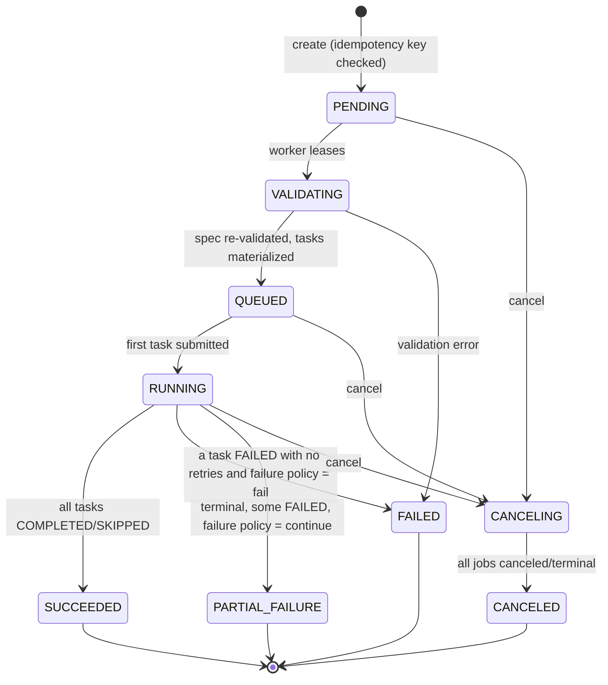
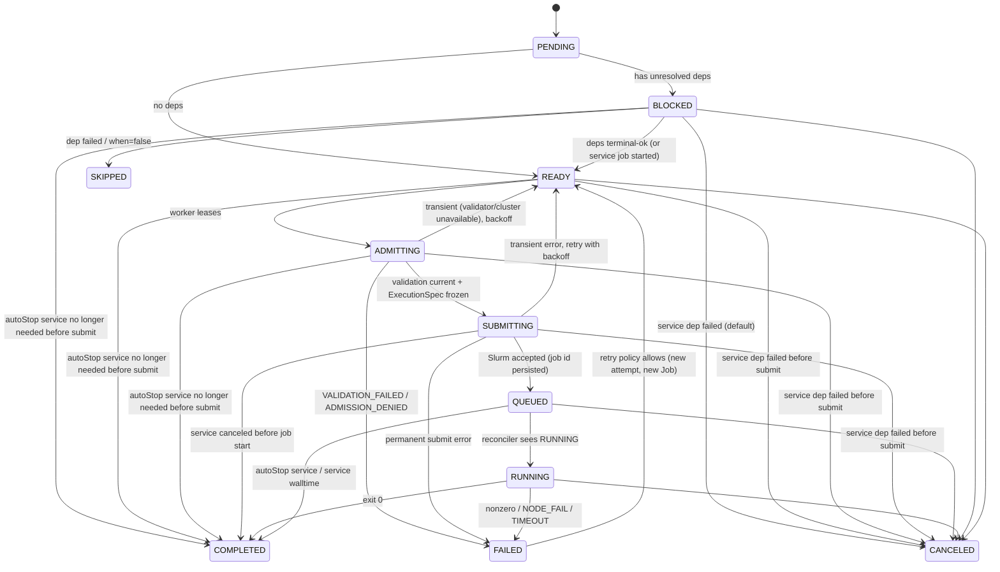

# Workflows

## Objects

| Object | Mutability | Purpose |
| --- | --- | --- |
| `Workflow` | mutable header | name, description, project scope, pointer to latest published version |
| `WorkflowVersion` | immutable once `published` | canonical spec (JSON), `spec_hash`, `schema_version`, `layout` (UI-only JSON), author, state `draft → published → deprecated` |
| `WorkflowExecution` | state machine | one run of exactly one version with resolved parameters |
| `TaskExecution` | state machine | one node instance (fan-out yields many per task) |
| `Job` | state machine | the Slurm-facing record for a task execution attempt |

Drafts are editable in place; publishing freezes them. Editing a published
version creates a new draft. Executions reference `workflow_version_id` and
also store a copy of `spec_hash` so tampering is detectable.
Normal executions require a published version. A draft may be run only with
`test: true`; while a non-terminal test execution exists, spec updates return
`DRAFT_LOCKED` (layout updates and publishing remain allowed). Test executions
remain pinned to their captured hash if the version is later published or
deprecated.

The UI layout (node positions, collapsed groups, colors) is stored in
`layout` and is **never** read by the engine.

## Specification (`custos.io/v1alpha1`)

Authoritative definition: Go types in `internal/workflowspec` with a
hand-written JSON Schema (`internal/workflowspec/schema/v1alpha1.json`,
coverage-tested against the Go types) consumed by the UI and CLI and
served unauthenticated at `GET /api/v1/schemas/workflow/v1alpha1`.
YAML is accepted at the API and converted to canonical JSON
(sorted keys) before hashing and storage.

**v1 limitations (fail closed, all verified by validation):**
`placement.requirements` and `fanOut.from` are rejected as reserved;
`software` requirements resolve at admission against the placement
cluster's `software_modules` map and fail closed with
`SOFTWARE_UNAVAILABLE` when no entry matches (ADR-023);
`stageIn`/`stageOut`/`interactive` task types are reserved.

```yaml
apiVersion: custos.io/v1alpha1
kind: Workflow
metadata:
  name: gaussian-simulation
  labels: { domain: chemistry }
spec:
  parameters:
    molecule:   { type: string, required: true, pattern: "^[a-zA-Z0-9_-]{1,64}$" }
    iterations: { type: integer, default: 100, minimum: 1, maximum: 100000 }
    shards:     { type: integer, default: 4, minimum: 1, maximum: 256 }

  placement:                       # workflow default; tasks may override
    cluster: summit                # OR requirements: {...}
    # requirements:
    #   gpu: { type: H100, count: 8 }
    #   memoryPerNode: 512Gi

  defaults:
    account: null                  # resolved from project binding unless overridden
    partition: compute
    qos: normal
    workingDirectory: "/scratch/{{ run.id }}"   # run.id, run.workflow, run.version
    env:
      OMP_NUM_THREADS: "{{ task.resources.cpu }}"

  secrets:                         # tenant SecretReference names
    hfToken: { ref: hf-token, use: env, envName: HF_TOKEN }
    license: { ref: license-key, use: wrapped_token }

  tasks:
    - name: prepare
      resources: { cpu: 4, memory: 8Gi, walltime: 30m }
      command: ["./prepare", "{{ parameters.molecule }}"]
      outputs:
        shardList: { type: file, path: "shards.json" }

    - name: simulate
      launch: srun
      dependsOn: [prepare]
      fanOut:
        count: "{{ parameters.shards }}"      # static fan-out from a parameter
        # OR from: prepare.outputs.shardList  # dynamic fan-out (Milestone 5b)
      resources: { nodes: 8, tasksPerNode: 64, memoryPerNode: 128Gi, walltime: 4h }
      command: ["./simulate", "--shard", "{{ item.index }}"]
      retry: { attempts: 2, on: [FAILED, NODE_FAIL] }

    - name: merge
      dependsOn: [simulate]        # fan-in: waits for all simulate instances
      when: "{{ tasks.simulate.succeededCount }} > 0"
      resources: { cpu: 16, memory: 64Gi, walltime: 1h }
      command: ["./merge"]

    - name: train
      dependsOn: [merge]
      resources: { gpu: { count: 4, type: a100 }, cpu: 32, memory: 256Gi, walltime: 12h }
      software:                    # structured; resolved against the cluster software catalog
        - { name: python, version: "3.13" }
        - { name: cuda, version: "12.8" }
      script: { ref: "sha256:9f2c…", language: python }   # payload stored content-addressed
      args: ["--epochs", "{{ parameters.iterations }}"]
      env: { WANDB_MODE: offline }

    - name: sweep
      dependsOn: [merge]
      array: { start: 0, end: 99, maxConcurrent: 20 }
      command: ["./sweep", "{{ array.taskId }}"]
```

### Launch model and task compatibility (v1alpha1)

A Slurm-backed task is submitted as one sbatch allocation. Its `launch`
field controls only how the payload is started inside that allocation:

| launch | Wrapper behavior |
| --- | --- |
| omitted or `sbatch` | Run the executable once in the batch script. Resource counts describe the allocation; they do not repeat the executable. |
| `srun` | Start the executable once under `srun`; ordinary tasks emit `--ntasks=N` when `resources.tasks` is positive, otherwise inherit the allocation. OpenMPI/MPICH multinode steps use `--mpi=<plugin>` and inherit their resolved rank allocation. |

`type: batch`, `mpi`, `gpu`, and `array` remain accepted as deprecated
compatibility aliases for stored specs; legacy `type: mpi` defaults to
`launch: srun`, and the other aliases default to `sbatch`. They are not
normalized during decode or canonical hashing, so existing published spec
hashes remain unchanged. New documents omit `type` unless using `shell` or
`condition`. `type: array` still requires an `array` block, but an `array`
block is also valid on any Slurm-backed non-condition task.

| type | Slurm mapping | Notes |
| --- | --- | --- |
| omitted, `batch`, `mpi`, `gpu`, `array` | one sbatch allocation | `launch` controls whether the payload itself runs under srun |
| `shell` | Custos wrapper executing the payload as an unrestricted shell script | privileged; gated by `workflow.publish` plus `allowShellTasks: true` in the effective ValidationPolicy — there is deliberately no `workflow.shell` permission; command absent, `script` present |
| `stageIn` / `stageOut` | sbatch on a data-mover partition (or future control-plane mover) | v1alpha1 reserves the type; implementation Milestone 7+ |
| `interactive` | reserved (`salloc`/`srun --pty` or Jupyter) | model reserved; not executed before Milestone 8+ |
| `condition` | no Slurm job; engine evaluates expression | for `when` on downstream tasks; cannot specify `launch` or `array` |

Every Slurm-backed task carries either `command` (argv executed directly by
the wrapper) or `script` (a stored `{ref, language}` or inline source) plus
optional `args`. Scripts are validated and pinned by content digest; inline
source also remains in the immutable spec (`docs/script-validation.md`).
Scheduler settings live only in `resources`/`placement`/`defaults`, never in
the payload. `shell`
differs from `batch`+`script` only in that its payload may be any shell
text including constructs the advisory scanners flag; it is the escape
hatch, gated accordingly.

### Service tasks

Setting `service` makes a Slurm-backed task a long-running service. Services
require `resources.walltime`; `array`, `fanOut`, `retry`, `when`, and `outputs`
are unsupported, as are `condition` and approval task kinds. Images and
multinode configurations remain available. `autoStop` defaults to `true`.

```yaml
tasks:
  - name: db
    service: { autoStop: true }
    launch: sbatch
    resources: { walltime: 2h, cpu: 2 }
    script: |
      #!/bin/bash
      exec postgres -D "$CUSTOS_JOB_DIR/pg"
  - name: client
    dependsOn: [db]
    script: |
      #!/bin/bash
      psql "host=$CUSTOS_SERVICE_DB_HOST" -f query.sql
```

A service may depend on ordinary tasks (which must finish first) or other
services. A service dependency is satisfied when its Slurm job has started;
the dependent's submission carries `after:<service-job-id>`. No readiness
probe is performed. Before dependent submission, a failed service cancels the
dependent with `DEPENDENCY_FAILED` by default; `onDependencyFailure: run`
submits it without that `after` dependency. A service failure after a
dependent is submitted does not cancel that dependent; the execution's normal
failure policy still applies.
Service dependencies must resolve to the same cluster: conflicting explicit
placements fail static validation with `SERVICE_CLUSTER_MISMATCH`, and
admission compares the actual cluster IDs again before freezing the dependent.

For each service dependency, Custos exports
`CUSTOS_SERVICE_<NAME>_JOBID` and best-effort
`CUSTOS_SERVICE_<NAME>_HOST`. `<NAME>` is the uppercased task name with every
non-`[A-Z0-9]` character replaced by `_`; normalized service-name collisions
are rejected. The job ID is numeric. At job start, the wrapper expands the
service node list with `squeue` and `scontrol`; HOST may be empty if the
service is no longer visible. Both variables are controlled runtime values,
reserved from task/default environment overrides, and passed into containers.

With `autoStop: true`, Custos cancels a service after every direct dependent
is terminal, and also cancels remaining auto-stop services when all
non-service tasks are terminal. The resulting Slurm cancellation is recorded
as task `COMPLETED` with `SERVICE_STOPPED`; an unsubmitted service that is no
longer needed is completed with the same reason without creating a job. A
service with no dependents and no non-service tasks runs to its natural exit
or walltime. With
`autoStop: false`, it runs until exit or walltime; a Slurm `TIMEOUT` becomes
task `COMPLETED` with `SERVICE_WALLTIME`. An independent nonzero service exit
is a normal task failure. Execution cancellation cancels services through the
ordinary job-cancel path.

Task-level sbatch export renders a service task as its ordinary script and
adds a comment that Custos service lifecycle/`autoStop` behavior is not
represented. As for other tasks, dependency scheduling is not exported;
the dependent export carries only the existing dependency comment.

### Images, inline scripts, and multinode

`image` is optional per task; tasks without it keep the ordinary host
execution path. Image URIs are restricted to safe `docker://`, `oras://`, or
absolute-path references and may be digest-pinned with `@sha256:<hex>`. The
platform cluster's `container_runtime` selects `apptainer` or `pyxis`, an
optional image-prefix allow-list, digest requirement, MPI plugin, and whether
a compatible Slurm client is available inside the image. No site bind paths
are configured by tasks; both runtimes mount `$CUSTOS_JOB_DIR` plus the cluster's
node mounts (ADR-032): the shared NFS mounts and the tenant's own mounts,
bound at the **same paths** inside the container, read-only where the admin
configured `ro`. Other tenants' mounts are never bound. The set is frozen in
`ExecutionSpec.isolation.mounts` at admission; the wrapper checks each target
with `mountpoint -q` before launching and exits 97 with `custos: required
node mount <target> is missing (node bundle out of date?)` when one is absent.
Apptainer receives one extra `--bind /a:/a:ro,/b:/b`; Pyxis appends the same
entries to `--container-mounts`. Non-container tasks use the host paths
directly.

Private images may declare `image.pullSecret` with exactly one literal
`username` or `usernameSecret`, and a required `passwordSecret`. Secret handles
must be declared in `spec.secrets` with `use: image_pull`, and the referenced
SecretReferences must allow `image_pull`. Image-pull secrets are never task
environment values. Literal usernames are limited to 256 characters and
cannot contain whitespace or control characters. Pyxis accepts only
`docker://`; Apptainer accepts
`docker://` and `oras://` pull-secret URIs. Pull-secret tasks must be
single-node (`multinode` and `resources.nodes > 1` are rejected); arrays are
supported.

```yaml
spec:
  secrets:
    registryUser: { ref: registry-user, use: image_pull }
    registryToken: { ref: registry-token, use: image_pull }
  tasks:
    - name: private-run
      image:
        uri: docker://registry.example.com/team/app:1.2
        pullSecret:
          usernameSecret: registryUser
          passwordSecret: registryToken
      command: ["./run"]
```

`script` accepts a content-addressed `{ref, language}` object, an inline
`{inline: | ...}` object, or inline text as shorthand. Inline source remains
in the immutable spec; create/update stores the same bytes content-addressed,
and admission stores/verifies them again before freezing the payload digest.
The effective language uses an explicit `language` when supplied, otherwise
it is inferred from an inline shebang (`sh`, `bash`, or `python`) without
rewriting the spec.

```yaml
- name: mpi-hello-world
  env: { PATH: /usr/lib64/openmpi/bin:/usr/local/bin:/usr/bin:/bin }
  image: { uri: oras://docker.io/anderbubble/openmpi-hello-world.sif }
  script:
    inline: |
      #!/bin/sh
      mpi_hello_world
  resources: { cpu: 4, cpuAffinity: numa, memory: 1GB, walltime: "00:05:00" }
  multinode: { nodes: 1, implementation: openmpi }

- name: generic-multinode
  image:
    uri: oras://docker.io/anderbubble/openmpi-hello-world.sif@sha256:dc92ea0c541a8d9f30b4d6b78bfc57bd2fe9806689d93ece6069c6ed6519fa9a
  env: { PATH: /usr/lib64/openmpi/bin:/usr/local/bin:/usr/bin:/bin }
  command: [mpirun, -H, $MULTINODE_HOSTLIST, --mca, plm_rsh_agent, $MULTINODE_SSH_WRAPPER, -np, $MULTINODE_TOTAL_SLOTS, /usr/lib64/openmpi/bin/mpi_hello_world]
  resources: { cpu: 2, cpuAffinity: numa, memory: 1GB, walltime: "00:05:00" }
  multinode: { nodes: 2, implementation: generic }
```

`env` accepts either a string map or a list of `NAME=VALUE` strings. Lists
split on the first `=` and reject invalid or duplicate names; canonical specs
use the map form. For image tasks, user env is passed into the container via
`/usr/bin/env KEY=VALUE` inside either runtime, not into the Slurm submission
environment or the host environment. Images must contain `/usr/bin/env`.
Pyxis `--container-env` carries only runtime, secret, and `MULTINODE_*` names
whose host-provided values override image defaults. Image tasks may set `PATH`
and `LD_LIBRARY_PATH`; Custos, Slurm, container-runtime, and generated names
stay reserved.

`resources.cpuAffinity` is `none`, `core`, `socket`, or `numa`; it maps to
`srun --cpu-bind=cores|sockets|ldoms`. A batch wrapper without a final srun
exports controlled `SLURM_CPU_BIND` so nested srun steps inherit the choice.
For multinode tasks, `resources.cpu` means CPUs per node (default 1) and
`resources.memory` remains per node. OpenMPI and MPICH default `procsPerNode`
to `cpu`, request `nodes × procsPerNode` ranks, and use `srun --mpi=<plugin>`;
`cpusPerTask` resolves to `cpu / procsPerNode`, which must divide evenly.
Generic multinode runs its command once, allocates one Slurm task per node,
and uses `procsPerNode` (default `cpu`) as its slot count. It exports
`MULTINODE_HOSTLIST`, `MULTINODE_HOSTLIST_NOSLOTS`, `MULTINODE_TOTAL_SLOTS`,
`MULTINODE_NODE_IP`, `MULTINODE_SSH_WRAPPER`, and `MULTINODE_RSH_WRAPPER`;
the remote wrapper uses `srun --overlap` rather than SSH. Whole-element
`{{ multinode.* }}` or `$MULTINODE_*` argv values are accepted only on a
generic multinode task; embedded values remain literal. Generic image tasks
require a cluster with `slurm_in_container` enabled and an image containing a
compatible Slurm client.

A multinode block conflicts with arrays and explicit resource `nodes`,
`tasks`, or `tasksPerNode`; an explicit launch must agree with the selected
implementation. Task-level sbatch export returns `EXPORT_UNSUPPORTED` for
images and multinode configurations because the runtime and launcher context
are cluster-specific.

### Templating

Mustache-like `{{ }}` with a **restricted expression language**: dotted
lookups in `parameters`, `run`, `task`, `item`, `array`, `multinode`, `tasks.<name>.*`,
`secrets.<handle>` (only as the entire env value and only for `use: env`),
plus comparison/boolean operators and integer arithmetic for `when`
and `fanOut.count`. No function calls, no loops, no string-to-code. All
substitutions happen into argv elements or env values, never into shell
text. One exception: `{{ array.taskId }}` does not render to text — it
becomes the allow-listed runtime reference `"$SLURM_ARRAY_TASK_ID"` in
the generated wrapper, so it is legal only on a task with an `array`
spec and as the **entire** argv element or env value (never embedded in
literal text or arithmetic); static validation rejects it otherwise
(`REF_ARRAY_RUNTIME_WHOLE`). `{{ multinode.hostlist }}`,
`hostlistNoSlots`, `totalSlots`, `nodeIp`, `sshWrapper`, and `rshWrapper` are
runtime values only as whole command/args elements on generic multinode tasks
(`MULTINODE_REF`). The equivalent whole argv elements `$MULTINODE_HOSTLIST`
and `${MULTINODE_HOSTLIST}` are accepted for Fuzzball compatibility; embedded
forms remain literals.
Implementation: hand-written lexer/parser in `internal/workflowspec/expr`
(~500 lines) rather than pulling in a general template engine; the small
grammar is a security feature.

### Resource units

`cpu: 4`, `memory: 8Gi|8G|8192Mi|1GB|512MiB`,
`walltime: 30m|4h|1-12:00:00`, `gpu: {count, type?}`, `nodes`,
`tasksPerNode`, `cpusPerTask`, `memoryPerNode`, `memoryPerCpu`. `memory` and
`memoryPerNode` request per-node memory; `memoryPerCpu` requests memory per
allocated CPU and cannot be combined with either. Decimal `KB` through `EB`
units scale by 1000; `KiB` through `EiB` scale by 1024; suffix matching is
case-insensitive. Memory resolves to MiB, including for multinode requests.
Parsed with `k8s.io/apimachinery/pkg/api/resource`-compatible semantics
reimplemented locally (avoid importing apimachinery for one type).

## Validation (backend, always)

Order:

1. Schema (JSON Schema + Go struct decoding with unknown fields rejected).
2. Names: DNS-label-like, unique across tasks and parameters.
3. Graph: `dependsOn` targets exist; DAG (Kahn's algorithm) — cycle → list
   the cycle in the error; no self-deps.
4. Expressions parse; references resolve to declared symbols; `secrets.*`
   only inside declared uses.
5. Task type supported and permitted by tenant/project policy (`shell`
   requires explicit permission).
6. Resource requests satisfiable: against effective policy (max walltime,
   nodes, partitions, qos) **and** against the target cluster's
   capabilities when placement is explicit (partition exists, GRES type
   exists, within partition limits).
7. Secrets: every `secrets.*.ref` resolves in the same tenant. Env delivery
   requires a generic reference allowing `workflow_env`; wrapped delivery
   requires `wrapped_token` and the platform OpenBao connector. At execution,
   the persisted requester must still have `secret.reference.use` as owner,
   tenant-admin, or through a reference scoped to the execution project;
   otherwise validation ends `FAILED/SECRET_FORBIDDEN`.
8. Placement: named cluster is bound to the project; requirements
   expressible.

Validation returns **all** errors (path-addressed: `spec.tasks[2].resources.walltime`)
so the editor can annotate nodes.

`POST .../workflows/{id}/versions/validate` runs 1-8 without persisting;
`publish` runs them again.

## Execution state machines

### WorkflowExecution


```mermaid
stateDiagram-v2
    [*] --> PENDING: create (idempotency key checked)
    PENDING --> VALIDATING: worker leases
    VALIDATING --> QUEUED: spec re-validated, tasks materialized
    VALIDATING --> FAILED: validation error
    QUEUED --> RUNNING: first task submitted
    RUNNING --> SUCCEEDED: all tasks COMPLETED/SKIPPED
    RUNNING --> FAILED: a task FAILED with no retries and failure policy = fail
    RUNNING --> PARTIAL_FAILURE: terminal, some FAILED, failure policy = continue
    PENDING --> CANCELING: cancel
    QUEUED --> CANCELING: cancel
    RUNNING --> CANCELING: cancel
    CANCELING --> CANCELED: all jobs canceled/terminal
    SUCCEEDED --> [*]
    FAILED --> [*]
    PARTIAL_FAILURE --> [*]
    CANCELED --> [*]
```

### TaskExecution


```mermaid
stateDiagram-v2
    [*] --> PENDING
    PENDING --> BLOCKED: has unresolved deps
    PENDING --> READY: no deps
    BLOCKED --> READY: deps terminal-ok (or service job started)
    BLOCKED --> COMPLETED: autoStop service no longer needed before submit
    BLOCKED --> SKIPPED: dep failed / when=false
    BLOCKED --> CANCELED: service dep failed (default)
    READY --> ADMITTING: worker leases
    READY --> COMPLETED: autoStop service no longer needed before submit
    READY --> CANCELED: service dep failed before submit
    ADMITTING --> SUBMITTING: validation current + ExecutionSpec frozen
    ADMITTING --> READY: transient (validator/cluster unavailable), backoff
    ADMITTING --> COMPLETED: autoStop service no longer needed before submit
    ADMITTING --> CANCELED: service dep failed before submit
    ADMITTING --> FAILED: VALIDATION_FAILED / ADMISSION_DENIED
    SUBMITTING --> QUEUED: Slurm accepted (job id persisted)
    SUBMITTING --> READY: transient error, retry with backoff
    SUBMITTING --> COMPLETED: service canceled before job start
    SUBMITTING --> CANCELED: service dep failed before submit
    SUBMITTING --> FAILED: permanent submit error
    QUEUED --> RUNNING: reconciler sees RUNNING
    RUNNING --> COMPLETED: exit 0
    QUEUED --> COMPLETED: autoStop service / service walltime
    RUNNING --> FAILED: nonzero / NODE_FAIL / TIMEOUT
    FAILED --> READY: retry policy allows (new attempt, new Job)
    QUEUED --> CANCELED
    RUNNING --> CANCELED
    BLOCKED --> CANCELED
    READY --> CANCELED
```

`ADMITTING` is the only path into `SUBMITTING`: it verifies the payload
digest against the persisted `ScriptValidation`, re-validates if stale, and
freezes the `ExecutionSpec` from which the Slurm submission is derived. See
`docs/script-validation.md`.

Transitions are executed as `UPDATE ... WHERE id=$1 AND state=$2 AND version=$3`
inside a transaction that also enqueues the follow-up work item; a zero-row
update means someone else moved it — the worker reloads and re-evaluates.
The transition table is data (`map[State][]State`) with a test that the
diagram above and the table agree.

## Engine strategy: Slurm dependencies + Custos reconciliation

General task dependencies are engine-driven for every value of
`spec.execution.strategy` (`auto`|`engine`|`native`, stored on the
execution): a task is submitted only when it becomes `READY`. Dynamic
fan-out, `when`, retries, cross-cluster placement, and service failure policy
continue to be reconciled by Custos.

The exception is an edge to a service task after its Slurm job has started.
The dependent is still admitted and submitted by the engine, but its Slurm
`JobSubmission` carries `--dependency=after:<service-job-id>`. Slurm gates the
dependent's start; Custos does not perform a readiness probe. General
same-cluster `afterok` dependency batching remains a future optimization.

`spec.execution.failurePolicy: fail|continue` (default `fail`) controls
terminal accounting: with `fail` the first task failure cancels/skips
remaining work and the execution ends `FAILED`; with `continue` the DAG
runs to completion and the execution ends `PARTIAL_FAILURE` when any
task failed.

## Idempotency

`POST /workflow-executions` requires `Idempotency-Key`. Stored in
`idempotency_keys(tenant_id, key, request_hash, response_status,
response_body, execution_id, expires_at)` with a unique constraint; the
insert happens in the same transaction as the execution row. Replay with
the same key + same body returns the stored response; same key + different
body → `409 IDEMPOTENCY_KEY_REUSED`. Keys expire after 24h.

Within the engine, each `TaskExecution` attempt has a deterministic Slurm
job name `custos-<job-uuid>`; the submit worker checks Slurm for that name
before submitting (see `docs/workers.md`).

## Alternatives considered for representation (ADR-005)

| Option | Verdict |
| --- | --- |
| Free-form shell script per workflow | Rejected: unvalidatable, unauditable, no DAG |
| CWL / WDL / Snakemake / Nextflow DSL | Rich, but each is a full language with its own runtime expectations; wrapping them is a separate integration ("run a Nextflow pipeline as a task"), not our core format |
| Argo Workflows CRD shape | Kubernetes-flavored; too many Pod concepts |
| Own declarative YAML with strict schema (chosen) | Small, validatable, maps 1:1 to sbatch semantics, editor-friendly |
